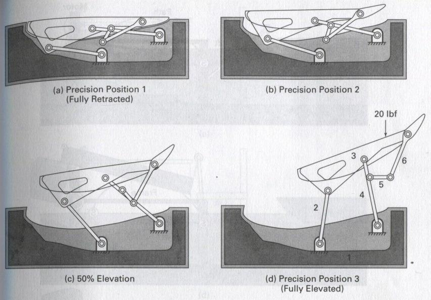
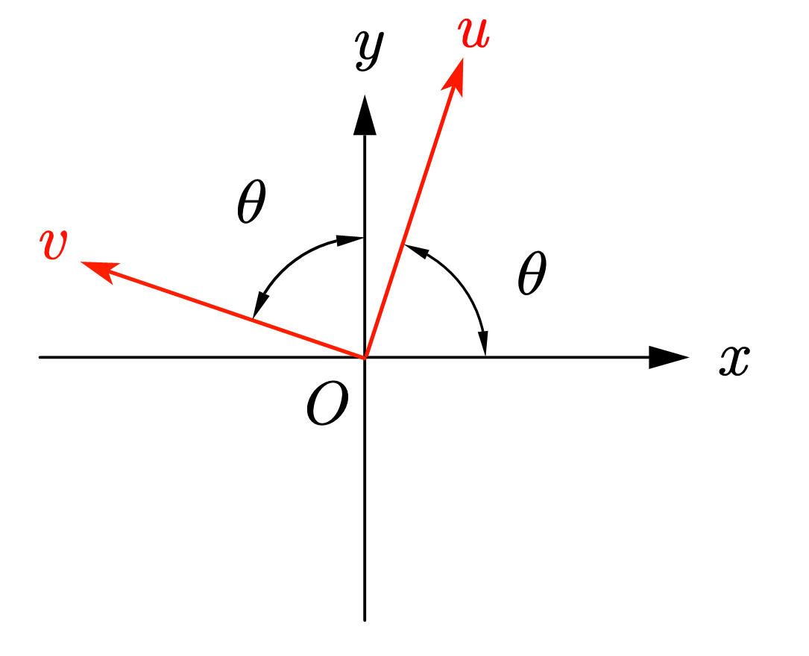

---

---

# 平面四杆机构+一种六杆机构求解+Matlab动画制作

## 一、平面四杆机构的求解

<center><center>
<center>图1. 平面四杆机构示意图</center>

​		我们可以利用两个封闭矢量多边形，建立方程：
$$
\overrightarrow{L_{2}}+\overrightarrow{L_{3}}=\overrightarrow{L_{1}}+\overrightarrow{L_{4}}
$$
​		再分别投影到x轴和y轴得到分量方程：
$$
\begin{array}{l}
L_{2} \cos \theta_{2}+L_{3} \cos \theta_{3}=L_{1} \cos \theta_{1}+L_{4} \cos \theta_{4} \\
L_{2} \sin \theta_{2}+L_{3} \sin \theta_{3}=L_{1} \sin \theta_{1}+L_{4} \sin \theta_{4}
\end{array}
$$
​		此方程直接求解较为困难，我们有两种方式。

### 方法一：几何法

​		连接BD，解三角形

<center><center>
<center>图2. 平面四杆机构求解示意图</center>

1. 连接B、D，利用余弦定理可以求解出杆BD长度，进而用正弦公式求解出$\varphi_1$

2. 再利用余弦公式，解三角形BCD，可得出$\theta_2$和$\varphi_2$，而$\theta_3=\pi-\varphi_1-\varphi_2$

3. B的横纵坐标由$L_2$和$\theta_2$给出，C的横纵坐标由$L_4$和$\theta_4$给出，至此平面四杆机构求解完毕。

### 方法二：数值解

​		我们已经得到了投影到x轴和y轴得到分量方程：
$$
\begin{array}{l}
L_{2} \cos \theta_{2}+L_{3} \cos \theta_{3}=L_{1} \cos \theta_{1}+L_{4} \cos \theta_{4} \\
L_{2} \sin \theta_{2}+L_{3} \sin \theta_{3}=L_{1} \sin \theta_{1}+L_{4} \sin \theta_{4}
\end{array}
$$
<center><center>
<center>图3. 平面四杆机构示意图（图1再放一遍）</center>


​		那么我们可以使用`Matlab​`的`optimvar`以及`solve`函数来求解（t1即为$\theta_1$，其他类似）：

```matlab
xot = optimvar('xot',2); %解关节C，xot(1)为t4,xot(2)为t3
eq1 = L2*cos(t2)+L3*cos(xot(2)) == L1+L4*cos(xot(1));
eq2 = L2*sin(t1)+L3*sin(xot(2)) == L1+L4*sin(xot(1));
prob = eqnproblem;
prob.Equations.eq1 = eq1;
prob.Equations.eq2 = eq2;
x00.xot = [t1 pi/6]; %给定初值，t4初值给定与t1相同，t3初值设为pi/6
[sol,fval,exitflag] = solve(prob,x00);
t2 = x00.xot(1);
```

​		解出$\theta_2$和$\theta_4$后的坐标求解不再赘述。

## 二、一种六杆机构求解——汽车扰流板设计

​		汽车扰流板是指安装在轿车后箱盖上的类似倒装的飞机尾翼的部件。有的汽车上装有前扰流板，俗称气坝。有的汽车上侧部装有侧裙，也是扰流板的一种。后扰流板实际上它也被称为“汽车尾翼”。一方面，它使轿车外形增添了动感；另一方面，它更重要的作用是有效地减少了车辆在高速行驶时产生的空气阻力，既节省了燃料，同时也提高了车辆行驶的稳定性。一种可以做平面运动汽车扰流板的结构如下图所示：



<center>图4. 一种赛车扰流板运动结构示意图</center>

​		绘制出其CAD图纸并进行标注如下，为简化模型，假设B、C、F共线：

<center><center>
<center>图5. 赛车扰流板示意图</center>

​			我们可以把其分为两部分：求解平面四杆机构（ABCD）和求解其他节点(EFGHJ)。其中平面四杆机构（ABCD）节点求解过程不再赘述，下面主要讲解其他节点的求解过程。

### E点的求解

​		C、E、D共线，故,
$$
\begin{cases}\displaylines{x_4-x_1=\frac{L_4}{L_5}(x_3-x_1)\\y_4-y_1=\frac{L_4}{L_5}(y_3-y_1)}\end{cases}
$$
​		解出$x_4$ ,$y_4$:
$$
\begin{cases}\displaylines{x_4=\frac{L_4}{L_5}(x_3-x_1)+x_1\\y_4=\frac{L_4}{L_5}(y_3-y_1)+y_1}\end{cases}
$$

### F点的求解

​		B、C、F共线,解法同E点。

### G点的求解

​		首先需要先判断三条杆能否构成三角形：两边之和是否大于第三边( L6+L7 > distance(E,F) )，然后再继续求解。

- 解法一：解四杆机构

  我们当然可以像解四杆机构ABCD那样解四杆机构CEGF，但是我们发现此时E点已知，于是有了解法二。

- 解法二：几何法——两圆交点

  C、E、F均已经解出，杆长都已知，此时G点可看作以E为圆心，L7为半径的圆和以F为圆心，L6为半径的圆的交点。需要注意的是，这两个圆有**两个交点**，我们所需要的交点为靠下的那个交点。写代码时，保存y**值较小的点**即可。

### J点的求解

- 解法一：解三角形

  由于$\triangle JBF$可看作一个直角三角形，且BC与水平线的夹角$\theta_3$前面已经求出，J相对于B的位置就变得很好求：
  $$
  \begin{cases}\displaylines{x_J-x_B=JB\times sin(\theta_3)\\y_J-y_B=JB\times cos(\theta_3)}\end{cases}
  $$
  解出$x_J$ ,$y_J$:
  $$
  \begin{cases}\displaylines{x_J=JB\times sin(\theta_3)+x_B\\y_J=JB\times cos(\theta_3)+y_B}\end{cases}
  $$
  

- 解法二：旋转矩阵

  如果将BH绕B点逆时针旋转90°，再进行适当的缩放，同样可以得到J点的坐标，旋转矩阵如下：
  $$
  M(\theta)=\left[\begin{array}{cc}
  \cos \theta & -\sin \theta \\
  \sin \theta & \cos \theta
  \end{array}\right]
  $$
  

  <center>图6. 坐标变换示意图</center>

  参照图7，旋转矩阵如此使用（**左乘**旋转矩阵即可）：
  $$
  \left[\begin{array}{l}
  p_{x} \\
  p_{y}
  \end{array}\right]=\left[\begin{array}{ccc||c}
  \cos \theta & -\sin \theta \\
  \sin \theta & \cos \theta
  \end{array}\right]\left[\begin{array}{l}
  p_{u} \\
  p_{v}
  \end{array}\right]
  $$
  在`Matlab`中效果如下：

  

  <center>图7. Matlab使用旋转矩阵效果</center>

  代码如下：

  ```matlab
  uv = [1/sqrt(2);1/(sqrt(2))];%初始坐标
  for t = 0:pi/100:2*pi
      M=[cos(t) -sin(t)
          sin(t) cos(t)];%旋转矩阵
      xy=M*uv;%左乘旋转矩阵
      clf
      plot([0,uv(1)],[0,uv(2)],'k','LineWidth',2)%原始向量用黑线表示
      hold on
      plot([0,xy(1)],[0,xy(2)],'r','LineWidth',2)%旋转后向量用红线表示
      axis equal
      xlim([-1.2,1.2])
      ylim([-1.2,1.2])
      grid on
      pause(.1)
  end
  ```

### H点的求解

- 解三角形

  FH和水平线的夹角 = FG和水平线的夹角+$(180^\circ-\angle HFG)$，其实就是利用了同位角，然后解法同点J，不再赘述。

- 旋转矩阵

  将FG绕F旋转固定角度即可，类似于J点。

### 运动学分析

​		速度就是坐标一阶导，可以用`Matlab`的`diff​`对各个点的横坐标求一阶差分求出各点速度，对各个点的速度求一阶差分求出各点加速度**（注意：此操作会导致数组元素-1，注意索引值）**。

## 三、动画的绘制与输出

​		绘图基础：你得会用`plot`函数，这个不用教吧。

#### 方法一：每次plot完之后pause一下

​		这种方法可以在实时编辑器（.mlx）下可以生成动画并导出（支持avi、mp4、gif）：

<center><center>
<center>图8. 实时编辑器中效果</center>

​		代码讲解：

1. 在一个循环中先清除上此次的画布`clf`，然后再大展拳脚。
2. 画出各个杆件，使用`'o-'`保证铰接处显示一个小圆
3. 这时需要`hold on`一下，要不然扰流板会在下一个图上出现
4. 使用`fill​`函数绘制一个填充形状
5. 为了美观设置一下透明度`alpha`
6. 使用`axis equal`保证横纵坐标是1：1的
7. `xlim`和`ylim`设置横纵范围
8. `pause(0.5)`，暂停0.5秒，否则会一闪而过（或者压根不闪）

```matlab
for i = xxxxx  %一个循环，变量为i
		clf %清除画布
    % 绘制杆件
    plot([X0(i),X2(i),X3(i),X1(i),X4(i),X5(i),X6(i),X3(i),X6(i),X7(i)],...
        [Y0(i),Y2(i),Y3(i),Y1(i),Y4(i),Y5(i),Y6(i),Y3(i),Y6(i),Y7(i)],'o-')
    hold on
    clear alpha %清除透明度
    % 绘制扰流板
    fi = fill([X2(i),X10(i),X6(i)],[Y2(i),Y10(i),Y6(i)],'r');
    alpha(0.2);
    % 保证坐标系不变形
    axis equal
    xlim([-150,250])
    ylim([-50,300])
    % 停留0.5秒
    pause(0.5)
end
```

#### 方法二：使用getframe捕获帧并用writeVideo生成动画

<center><center>
<center>图9. peaks输出动画效果</center>

```matlab
v = VideoWriter('peaks.avi');
open(v);

Z = peaks;
surf(Z)
axis tight manual
ax = gca;
ax.NextPlot = 'replaceChildren';

loops = 40;
F(loops) = struct('cdata',[],'colormap',[]);
for j = 1:loops
    X = sin(j*pi/10)*Z;
    surf(X,Z)
    drawnow
    F(j) = getframe(gcf);  %捕获帧
    % 返回图窗的 RGB 图像数据，并指定图像分辨率
%     cdata = print('-RGBImage','-r120');  
%     F(j) = im2frame(cdata);
    writeVideo(v,F(j));
end

close(v);
fig = figure;
movie(fig,F,2) %播放两次
```

#### 方法三：使用animatedline创建动画线条（适合用于生成轨迹动画）

<center><center>
<center>图10. sin输出动画效果</center>

​		创建初始动画线条对象。然后，通过循环向线条中添加 1,000 个点。在添加每个新点后，使用 `drawnow` 在屏幕上显示该新点，这种方法也支持在实时编辑器（.mlx）下导出（支持avi、mp4、gif）。

```matlab
h = animatedline;
axis([0,4*pi,-1,1])

x = linspace(0,4*pi,1000);
y = sin(x);
for k = 1:length(x)
    addpoints(h,x(k),y(k));
    drawnow
end
```

